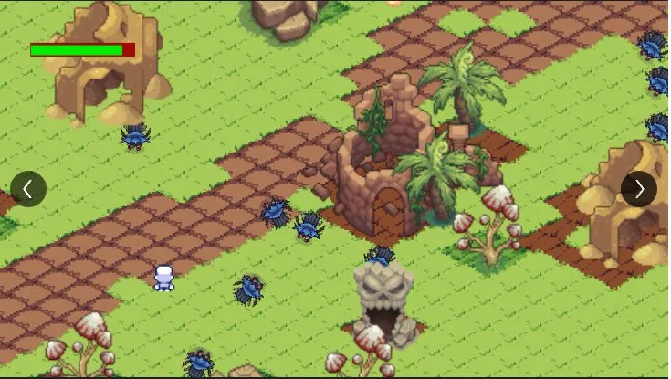

# 🏚️ Unutulmuş Şehir | Forgotten City

> **KBU Game Jam 2025** — 48 Saatte Yapıldı | Made in 48 Hours

---

## 🇹🇷 Türkçe

### 📖 Hikaye

Karakterimiz geçirdiği ağır bir hastalıktan sonra gözlerini açtığında köyünü tanıyamaz. Bir zamanlar huzurlu olan yurtları artık gizemli canavarlarla dolup taşmaktadır. Kaybettiği toprakları geri almak ve mirasını korumak için tek başına savaşa girer.

### 🎮 Oynanış

- İzometrik bakış açısıyla top-down aksiyon
- Düşmanlarla yakın dövüş
- Tilemap tabanlı açık alan level tasarımı
- Sağlık barı sistemi

### 🛠️ Yapım Detayları

|            |                     |
| ---------- | ------------------- |
| **Engine** | Unity               |
| **Grafik** | Pixel Art / Tilemap |
| **Süre**   | 48 Saat             |
| **Tema**   | Miras               |
| **Ekip**   | 2 Kişi              |

### 👥 Ekip

- **Senol Yusuf Bagdu** — Game Developer / Level Design

---

## 🇬🇧 English

### 📖 Story

When our character wakes up after a severe illness, they no longer recognize their village. What was once a peaceful homeland is now overrun by mysterious monsters. They set out alone to reclaim their lost lands and protect their heritage.

### 🎮 Gameplay

- Top-down action with isometric perspective
- Melee combat against enemies
- Open-world level design with Tilemap system
- Health bar system

### 🛠️ Details

|               |                     |
| ------------- | ------------------- |
| **Engine**    | Unity               |
| **Art Style** | Pixel Art / Tilemap |
| **Duration**  | 48 Hours            |
| **Theme**     | Heritage / Legacy   |
| **Team**      | 2 People            |

### 👥 Team

- **Senol Yusuf Bagdu** — Game Developer / Level Design

---

## 📸 Screenshot

---

_KBU Game Jam 2025 — Tema: Miras | Theme: Heritage_
